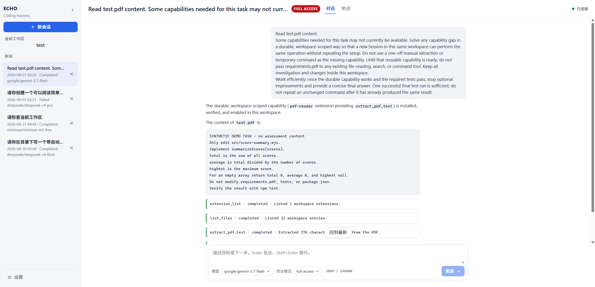

# ECHO Harness

[English](README.md)

**Execution · Context · Harness · Orchestration**

一个从零构建、轻量且本地优先的自主编程智能体。

ECHO Harness 是一个 Windows 优先的 TypeScript CLI。它连接 OpenAI-compatible 模型，运行显式的
Turn/Step 智能体循环，在受限工作区内执行工具，记录经过脱敏的 JSONL 事件，并通过仅监听回环地址的
Web 控制台开放同一套应用服务。

## 值得关注的设计

- **智能体循环由 ECHO 掌控。** Provider 传输、上下文投影、工具调度、安全策略、终止与恢复均在本
  仓库实现，而非委托给智能体框架。
- **证据是产品的一部分。** CLI 会区分模型文本、工具请求、失败、diff、测试结果与最终 Turn 状态；
  单个工具成功绝不会被当作整个任务成功的证明。
- **Windows 是经过测试的平台。** PowerShell 探测、非控制台进程、Unicode 路径、输出限制、超时、
  取消与进程树终止均有自动化覆盖。
- **安全策略集中管理。** 六个工具共享工作区隔离、校验、审批、硬拒绝、脱敏、超时与输出限制规则。
- **能力扩展过程可审查。** 用户明确确认 Full Access 后，Agent 可以编写、自测、检查、安装、热加载、
  禁用和卸载当前工作区内的扩展。扩展可以跨 Session 复用，但不会成为全局插件。
- **质量结果可复现。** Fake Provider 评测、可复位的失败测试夹具、覆盖率阈值、恶意扫描样本和
  Windows GitHub Actions 门禁共同提供可审查证据。

## 架构

```text
CLI / 本地 Web 控制台
   |
   v
Agent Loop -----> Context Projector -----> OpenAI-compatible Provider
   |                    ^
   |                    |
   +----> Safety Policy +----> 脱敏 JSONL Session Store
   |
   +----> Tool Registry ----> 文件 / PowerShell / 工作区扩展
```

P0 的六个工具为 `list_files`、`search_text`、`read_file`、`write_file`、`apply_patch` 和
`run_command`。工具调用按顺序执行，使状态变更、审批与终止事件保持确定性。

P3 增加 `full-access` 模式。该模式需要用户明确确认，并取消逐操作审批，但不会取消校验、取消机制、
超时、输出限制、脱敏或进程清理。Agent 只有在此模式下才能使用七个 `extension_*` 生命周期工具。
已安装扩展通过受限的 Worker 协议运行，保存在当前工作区的 `.echo/` 下；它并不是操作系统沙箱。

## 环境要求

- Windows 与 PowerShell
- Node.js 22
- Corepack，以及仓库锁定的 `pnpm@11.24.0`
- 用于真实运行的 OpenAI-compatible 接口、API Key 与模型名称

## 安装

```powershell
corepack enable
corepack prepare pnpm@11.24.0 --activate
pnpm install --frozen-lockfile
pnpm build
```

## 配置

非敏感配置只持久化到 `<artifact-root>/config/echo.config.json`。`artifact-root` 是 CLI 模块或可执行
文件所在目录（执行 `pnpm build` 后为 `dist/`），而不是 `process.cwd()`。使用交互式向导创建或更新
配置：

```powershell
pnpm build
node .\dist\cli.js config
$env:ECHO_API_KEY = '<secret>'
```

向导会询问 OpenAI-compatible Provider URL、自动发现或手动维护模型目录、默认模型与安全模式。所有
修改先保存在内存草稿中，最终确认后再原子写入文件。自动发现模式只持久化默认模型；候选模型 ID
随后通过 `GET /models` 获取，仅在进程内缓存，`run` 不依赖发现结果。Chat 的 `/model` 通过目录端口
列出候选模型。发现失败不会阻止已经配置的模型。`ECHO_API_KEY` 是唯一支持的敏感环境变量，绝不会
写入配置文件。`--model`、`--base-url` 与 `--safety-mode` 等 CLI 参数只覆盖本次 `run` 或 `chat`，
也不会查询模型目录。缺少配置时，`run` / `chat` 以退出码 `2` 结束并提示执行
`echo-harness config`。P1-2A 完成配置加载器，P1-2B 完成目录发现，P1-1B 完成 `chat`。加载器不会
读取 `ECHO_BASE_URL`、`ECHO_MODEL`、`ECHO_SAFETY_MODE`、工作区 `echo.config.json` 或工作区
`.echo/config`。

参见 [ADR-0002](docs/decisions/0002-p1-config-artifact-root.md) 与
[ADR-0005](docs/decisions/0005-restore-artifact-config.md)。

## 单次运行

```powershell
node .\dist\cli.js run "Inspect the project and fix the failing tests." `
  --workspace . `
  --safety-mode balanced `
  --non-interactive `
  --no-color
```

使用 `node .\dist\cli.js run --help` 查看完整参数列表。进度与诊断以分组的 Step 时间线写入 stderr，
模型最终回答写入 stdout。不同退出码用于区分配置、Provider、工具、策略、限制与取消失败。终端不是
TTY 时使用 ASCII；`--no-color` 会移除 ANSI，但不会改变标签或结构。

## 交互式 Chat

```powershell
node .\dist\cli.js chat --workspace .
node .\dist\cli.js chat --resume <session-id> --workspace .
```

`<session-id>` 可以是完整 ID，也可以是 Chat 横幅或 `/status` 中唯一的 8 位 `SESSION` 短 ID。

Chat 与 `run` 复用同一套应用服务。空闲时输入 `/help`、`/status`、`/model`、`/model refresh`、
`/safety` 或 `/quit` 可执行对应命令。括号粘贴最多形成一个 Turn，且不会被识别为 Slash 命令。
Turn 运行时按 Ctrl+C 会取消当前 Turn 并返回提示符；空闲时按 Ctrl+C 以退出码 `130` 退出。

## 本地 Web 控制台

```powershell
node .\dist\cli.js web --workspace .
node .\dist\cli.js web --workspace . --no-open
```

Phase A 为一个固定工作区启动 `127.0.0.1` 控制台。默认命令会打开由服务端签发并验证的回环地址
bootstrap URL；`--no-open` 只打印同一个 URL，不打开浏览器。控制台提供实时 Session/Turn/审批
API、聚合 Chat、SSE 重连、Provider 设置，以及受限的 Trace/Inspector 视图。它与 CLI 共用配置、
应用服务、安全策略和脱敏后的 Session 存储。



参见 [ADR-0007](docs/decisions/0007-local-web-console.md)、
[Web API 契约](docs/web-api.md)与 [WebUI 规范](docs/web-ui.md)。

## 可复位演示

固定演示讲述一个连续故事：检查代码、观察失败的 TypeScript 测试、定位缺陷、只修改源代码、重新运行
测试，并以证据结束任务。

```powershell
pnpm build
node scripts/demo-reset.mjs
$goal = (Get-Content -Raw .\fixtures\demo\prompt.txt).Trim()
node .\dist\cli.js run $goal `
  --workspace .\fixtures\demo `
  --safety-mode balanced `
  --non-interactive `
  --no-color `
  --max-steps 12
```

显式提供凭据后，真实 Provider 验收脚本会连续运行三次该故事：

```powershell
node scripts/demo-accept.mjs
```

复位方式、预期关键节点、隐私检查与录制降级方案参见 [docs/demo.md](docs/demo.md)。

P3 演示使用合成 PDF 制造能力缺口，不使用任何考核内容：

```powershell
pnpm build
pnpm p3:demo:reset
pnpm p3:demo:baseline
pnpm accept:p3-pdf
pnpm p3:demo:verify
```

演示只向 Agent 提供能力缺口与持久化约束，由 Agent 自行选择扩展和工具名称，创建并测试实现，完成
热加载，只修复允许修改的源文件，并在全新 Session 中复用该能力。验收脚本会拒绝一次性 PDF 读取
绕过和跨工作区泄漏。受保护输入的哈希与 Harness 外部的测试进程决定是否通过；模型不能自行证明
工作已经完成。

## 质量门禁

```powershell
pnpm check
pnpm eval:offline
pnpm smoke:demo
pnpm smoke:artifact
pnpm test:web:e2e
```

`pnpm check` 会执行格式检查、lint、严格类型检查、覆盖率测试、构建、CLI 冒烟、产物 cwd 与隔离 Web
冒烟、敏感信息扫描、身份信息扫描、Web 产物扫描及生成的恶意样本自测。Playwright 覆盖键盘、
无障碍、200% 缩放、重连、审批、Provider 密钥保密与大型 Trace Session。CI 只使用确定性的 Fake
Provider，绝不会接收真实 API Key。

打包后 Web 控制台的受控本地验收需要显式执行，且不会进入 CI：

```powershell
pnpm build
pnpm accept:web-provider
```

该脚本从环境变量或被 Git 忽略的 `.env.test` 读取 Provider 凭据，使用临时工作区验证
Chat/SSE/恢复/Trace，不打印响应正文或 Key，并恢复临时配置。细节与证据参见
[docs/testing.md](docs/testing.md) 和 [P2 验收矩阵](docs/plans/p2-acceptance-matrix.md)。

## 文档

- [架构](docs/architecture.md)
- [核心契约](docs/contracts.md)
- [安全模型](docs/security.md)
- [CLI 交互设计](docs/cli-ux.md)
- [演示指南](docs/demo.md)
- [测试与评测](docs/testing.md)
- [ADR-0001：项目基础](docs/decisions/0001-project-foundation.md)
- [ADR-0002：P1 配置与 artifact-root](docs/decisions/0002-p1-config-artifact-root.md)
- [ADR-0003：应用服务与可恢复 Session](docs/decisions/0003-p1-application-service-session.md)
- [ADR-0005：恢复 artifact-root 配置](docs/decisions/0005-restore-artifact-config.md)
- [ADR-0006：聚合模型内容与 reasoning 事件](docs/decisions/0006-reasoning-session-events.md)
- [ADR-0007：固定工作区本地 Web 控制台](docs/decisions/0007-local-web-console.md)
- [P1 CLI 计划](docs/plans/p1-cli.md)
- [P2 本地 WebUI 计划](docs/plans/p2-webui.md)
- [P2 验收矩阵](docs/plans/p2-acceptance-matrix.md)
- [ADR-0010：显式 Full Access 模式](docs/decisions/0010-full-access-mode.md)
- [ADR-0011：工作区范围扩展](docs/decisions/0011-workspace-extensions.md)
- [P3 扩展计划](docs/plans/p3-extensions.md)
- [P3 验收矩阵](docs/plans/p3-acceptance-matrix.md)
- [本地 Web API 契约](docs/web-api.md)
- [WebUI 产品与交互规范](docs/web-ui.md)

## 已知边界

- ECHO 不是操作系统沙箱。经过批准的 PowerShell 命令仍可访问当前用户有权访问的网络或文件。
- 当前版本不提供 MCP、多智能体执行、远程 Web 访问、全局扩展市场、OCR、Session 导出或通用回滚
  系统。CLI 与本地 Web 控制台复用同一套应用服务。
- 兼容性仅针对有限的 OpenAI-compatible 服务配置完成验证，而非所有 Provider 实现。
- 模型请求可能包含 Context Projector 选择的仓库片段。请只将 ECHO 用于你有权处理的代码与服务。
- 自动脱敏与扫描可以降低泄漏风险，但不能替代对 Git 元数据、截图、终端边框与提交材料的人工审查。
